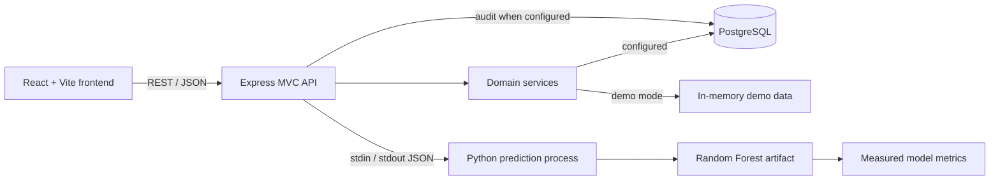

# FlightIQ

FlightIQ is a full-stack flight analytics and delay-prediction platform built
for software-engineering placement demonstrations. It combines a responsive
React analytics interface, a layered Express API, normalized PostgreSQL
storage, and a reproducible scikit-learn Random Forest pipeline.

The project is intentionally centered on data engineering, analytics, model
integration, API design, and explainability rather than CRUD screens or user
accounts.

## Highlights

- Network dashboard with delay trends, distributions, peak hours, and route reliability
- Historical flight search by number, route, airline, and date
- Delay classification, probability, and expected-delay regression
- Airline, airport, and route performance analytics
- Live model metrics, feature importance, and confusion matrix
- PostgreSQL-ready repositories with a dependable no-database demonstration mode
- Request validation, structured errors, health reporting, and prediction audit logs
- Reproducible dataset generation and model training
- Responsive glass-material interface using React, Recharts, and Lucide

## Architecture



The same controllers and service contracts are used in both PostgreSQL and
demonstration modes. Database configuration changes the data source without
changing the frontend API.

## Technology

| Layer | Technology |
| --- | --- |
| Frontend | React, Vite, JavaScript, CSS, Fetch API, Recharts, Lucide React |
| Backend | Node.js, Express, MVC services/repositories, CORS, dotenv |
| Database | PostgreSQL, `pg`, normalized SQL schema and indexes |
| Machine learning | Python, pandas, NumPy, scikit-learn, Joblib |
| Quality | Node test runner, ESLint, deterministic training seed |

## Project structure

```text
FlightIQ/
├── frontend/
│   ├── src/components/       Reusable interface components
│   ├── src/pages/            Dashboard, search, analytics, prediction, model
│   ├── src/services/         REST API client with resilient fallback
│   └── public/               Local visual assets
├── backend/
│   ├── config/               Environment and PostgreSQL pool
│   ├── controllers/          HTTP request/response boundary
│   ├── middleware/           Errors, request IDs, 404 handling
│   ├── models/               SQL repositories
│   ├── routes/               REST route declarations
│   ├── services/             Analytics, flight, prediction, model logic
│   ├── python/               Generation, preprocessing, training, inference
│   └── test/                 Service and validation tests
├── database/                 Schema, constraints, indexes, and seed SQL
├── dataset/                  Reproducible demonstration dataset
└── README.md
```

## Quick start: dependable demonstration mode

Requirements:

- Node.js 20 or newer
- Python 3.10 or newer

Install JavaScript packages:

```powershell
npm install
npm --prefix frontend install
npm --prefix backend install
```

Create the Python environment and install ML packages:

```powershell
python -m venv .venv
.\.venv\Scripts\pip.exe install -r backend\python\requirements.txt
```

The repository includes a trained model. To reproduce it:

```powershell
.\.venv\Scripts\python.exe backend\python\run_pipeline.py
```

Run frontend and backend together:

```powershell
npm run dev
```

Open [http://127.0.0.1:5173](http://127.0.0.1:5173). The API runs on
`http://127.0.0.1:5050` so it does not conflict with HealthSync on port 5000.

Without `DATABASE_URL`, FlightIQ intentionally uses its bundled demonstration
records while still executing the real trained Python model.

## PostgreSQL mode

1. Create a PostgreSQL database named `flightiq`.
2. Copy `backend/.env.example` to `backend/.env`.
3. Update `DATABASE_URL` for your PostgreSQL credentials.
4. Install the schema, seed records, and active model registry entry:

```powershell
npm --prefix backend run db:setup
```

5. Start the application with `npm run dev`.

### Database design

| Table | Responsibility |
| --- | --- |
| `airlines` | Canonical carrier identity and IATA code |
| `airports` | Canonical airport identity, city, location, and timezone |
| `routes` | Unique origin/destination pair, distance, and planned duration |
| `flights` | Dated service operation, schedule, actual times, status, and delay |
| `model_versions` | Training metadata, metrics, feature importance, active version |
| `prediction_logs` | Input features, result, model version, fallback flag, request ID |

Foreign keys protect route and flight integrity. Partial and composite indexes
optimize search, route analytics, delay rankings, and prediction-log auditing.

## REST API

Base URL: `http://127.0.0.1:5050/api`

| Method | Endpoint | Purpose |
| --- | --- | --- |
| GET | `/health` | Service, database, uptime, and timestamp status |
| GET | `/dashboard` | Network totals and dashboard chart datasets |
| GET | `/flights` | Paginated flight search and filters |
| GET | `/airlines` | Carrier performance analytics |
| GET | `/airports` | Airport traffic and delay analytics |
| GET | `/routes` | Route reliability analytics |
| GET | `/analytics?type=all` | Combined or scoped analytics |
| GET | `/model-insights` | Exported evaluation metrics and feature importance |
| POST | `/predict` | Delay probability and expected delay minutes |

Example prediction request:

```json
{
  "airline": "6E",
  "origin": "DEL",
  "destination": "BOM",
  "departureHour": 18,
  "month": 7,
  "dayOfWeek": "Wednesday",
  "distance": 1148,
  "weather": "Rain"
}
```

All responses use a consistent envelope:

```json
{
  "success": true,
  "data": {},
  "meta": {}
}
```

Errors include an HTTP status, readable message, validation details where
applicable, and a request ID for tracing.

## Machine-learning pipeline

1. `generate_dataset.py` creates deterministic demonstration records.
2. `preprocessing.py` imputes missing values, one-hot encodes categories, and scales numeric features.
3. `train.py` creates stratified train/test partitions and trains classification and regression forests.
4. Evaluation exports accuracy, precision, recall, F1, delay MAE, confusion matrix, and grouped feature importance.
5. Joblib saves both fitted pipelines in one versioned artifact.
6. `predict.py` accepts one JSON record over standard input and emits JSON for Express.

Current held-out demonstration metrics:

| Metric | Result |
| --- | ---: |
| Accuracy | 84.9% |
| Precision | 82.8% |
| Recall | 77.1% |
| F1 score | 79.8% |
| Delay mean absolute error | 5.22 minutes |

The dataset is synthetic and clearly identified in the UI and metadata. These
scores demonstrate the engineering pipeline; they are not claims about live
airline operations.

## Verification

```powershell
npm test
npm run build
```

Backend tests cover validation, filtering, and real model inference. The
frontend build includes ESLint and Vite production compilation.

## Placement demonstration flow

1. Explain the service/repository boundary and demo-to-PostgreSQL switch.
2. Filter a route on Flight Search and show the API response.
3. Submit contrasting clear-weather and storm predictions.
4. Open Model Insights and connect metrics to the exported artifact.
5. Show the normalized SQL design and prediction audit log.
6. Reproduce training to demonstrate deterministic engineering.

## Production evolution

- Replace synthetic records with licensed historical and live flight feeds
- Integrate a weather provider and scheduled ingestion jobs
- Add model-drift, calibration, latency, and data-quality monitoring
- Serve the model through a long-running worker for lower inference latency
- Add distributed tracing, rate limiting, and deployment health probes
- Calibrate probabilities against real regional and seasonal operations

## License

MIT. The background photograph is sourced from
[Unsplash](https://unsplash.com/photos/aoYAcFPf1m8).
